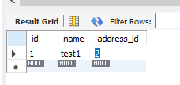
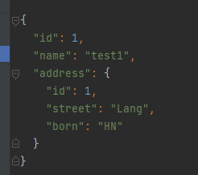
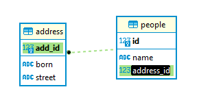
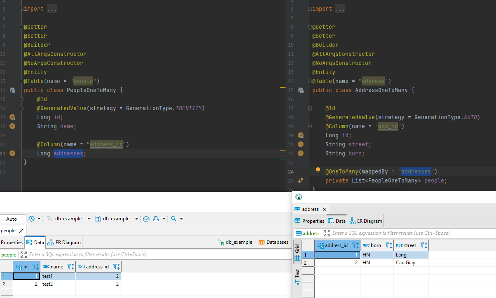
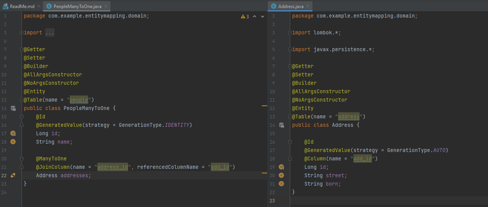

# @OneToOne

```java

@Table(name = "people")
public class People {
    @Id
    @GeneratedValue(strategy = GenerationType.IDENTITY)
    Long id;
    String name;

    @OneToOne(cascade = CascadeType.ALL)
    @JoinColumn(name = "address_id", referencedColumnName = "add_id")
//    @PrimaryKeyJoinColumn
    private Address address;
}


@Table(name = "address")
public class Address {

  @Id
  @GeneratedValue(strategy = GenerationType.AUTO)
  @Column(name = "add_id")
  Long id;
  String street;
  String born;
}
```



    GET http://localhost:8080/oneToOne

Result:




# @OneToMany


```sql
INSERT INTO db_example.people (id, name,address_id) VALUES
	 (1, 'test1',2),
	 (2, 'test2',2);
INSERT INTO db_example.address (add_id,born,street) VALUES
    (1,'HN','Lang'),
    (2,'HN','Cau Giay');


```






only need define @OneToMany in 1 side and config mapped with reference_column in n side

    // mapping with column address_id in people table
    @OneToMany(mappedBy = "addresses")
    private List<PeopleOneToMany> people;

```java

@Table(name = "address")
public class AddressOneToMany {

    @Id
    @GeneratedValue(strategy = GenerationType.AUTO)
    @Column(name = "add_id")
    Long id;
    String street;
    String born;
    // mapping with column address_id in people table
    @OneToMany(mappedBy = "addresses")
    private List<PeopleOneToMany> people;
}
@Table(name = "people")
public class PeopleOneToMany {
    @Id
    @GeneratedValue(strategy = GenerationType.IDENTITY)
    Long id;
    String name;

    // this is column in people table
    @Column(name = "address_id")
    Long addresses;

}
```

# @ManyToOne

```sql
INSERT INTO db_example.people (id, name,address_id) VALUES
	 (1, 'test1',2),
	 (2, 'test2',2);
INSERT INTO db_example.address (add_id,born,street) VALUES
    (1,'HN','Lang'),
    (2,'HN','Cau Giay');


```


only need define in n side

    @ManyToOne
    @JoinColumn(name = "address_id", referencedColumnName = "add_id")
    Address addresses;

