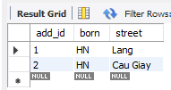

# @OneToOne

```java

@Table(name = "people")
public class People {
    @Id
    @GeneratedValue(strategy = GenerationType.IDENTITY)
    Long id;
    String name;

    @OneToOne(cascade = CascadeType.ALL)
    @JoinColumn(name = "address_id", referencedColumnName = "add_id")
//    @PrimaryKeyJoinColumn
    private Address address;
}


@Table(name = "address")
public class Address {

  @Id
  @GeneratedValue(strategy = GenerationType.AUTO)
  @Column(name = "add_id")
  Long id;
  String street;
  String born;
}
```



## Call OneToOne from people

because in database we have address_id. so we can redirect to any address

Example: people 1 has address 1 or 2 or 3 or 4

    GET http://localhost:8080/oneToOne

Result:

```json
[
    {
        "id": 1,
        "name": "test1",
        "address": null
    },
    {
        "id": 2,
        "name": "test2",
        "address": {
            "id": 2,
            "street": "Cau Giay",
            "born": "HN"
        }
    }
]
```
## Call OneToOne from address
because address doesn't have people_id column. So it will map with address by add_id

It means address id 1 will map with people id 1.

It cannot redirect to another id. it means if people doesn't have id 1 so address id 1 will have data in people property is null


    GET http://localhost:8080/oneToOne2

Result:

```json
[
  {
    "id": 2,
    "street": "Cau Giay",
    "born": "HN",
    "people": {
      "id": 2,
      "name": "test2",
      "addresses": 2
    }
  },
  {
    "id": 3,
    "street": "Lang",
    "born": "HN",
    "people": null
  }
]
```


# @OneToMany


```sql
INSERT INTO db_example.people (id, name,address_id) VALUES
	 (1, 'test1',2),
	 (2, 'test2',2);
INSERT INTO db_example.address (add_id,born,street) VALUES
    (3,'HN','Lang'),
    (2,'HN','Cau Giay');


```


only need define @OneToMany in 1 side and config mapped with reference_column in n side

    // mapping with column address_id in people table
    @OneToMany(mappedBy = "addresses")
    private List<PeopleOneToMany> people;

```java

@Table(name = "address")
public class AddressOneToMany {

    @Id
    @GeneratedValue(strategy = GenerationType.AUTO)
    @Column(name = "add_id")
    Long id;
    String street;
    String born;
    // mapping with column address_id in people table
    @OneToMany(mappedBy = "addresses")
    private List<PeopleOneToMany> people;
}
@Table(name = "people")
public class PeopleOneToMany {
    @Id
    @GeneratedValue(strategy = GenerationType.IDENTITY)
    Long id;
    String name;

    // this is column in people table
    @Column(name = "address_id")
    Long addresses;

}
```
## Request

    http://localhost:8080/oneToMany

```json
[
    {
        "id": 2,
        "street": "Cau Giay",
        "born": "HN",
        "people": [
            {
                "id": 1,
                "name": "test1",
                "addresses": 2
            },
            {
                "id": 2,
                "name": "test2",
                "addresses": 2
            }
        ]
    },
    {
        "id": 3,
        "street": "Lang",
        "born": "HN",
        "people": []
    }
]
```

# @ManyToOne

```sql
INSERT INTO db_example.people (id, name,address_id) VALUES
	 (1, 'test1',2),
	 (2, 'test2',2);
INSERT INTO db_example.address (add_id,born,street) VALUES
    (3,'HN','Lang'),
    (2,'HN','Cau Giay');


```


only need define in n side

    @ManyToOne
    @JoinColumn(name = "address_id", referencedColumnName = "add_id")
    Address addresses;


## Request

    http://localhost:8080/manyToOne

```json
[
    {
        "id": 1,
        "name": "test1",
        "addresses": {
            "id": 2,
            "street": "Cau Giay",
            "born": "HN"
        }
    },
    {
        "id": 2,
        "name": "test2",
        "addresses": {
            "id": 2,
            "street": "Cau Giay",
            "born": "HN"
        }
    }
]
```